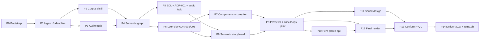

# DA Camp × NilePay — "The Illustrated Film"
## Master production plan for Claude Code (ultracode)

> **Status:** plan only. Nothing in this repository has been executed, rendered or uploaded yet.
> The only work done so far was a read-only reconnaissance of the six source archives (listing, hashing,
> media probing, reading the key docs) so that this plan is based on your actual files, not guesses.
> The findings are in [`01_SOURCE_RECON.md`](01_SOURCE_RECON.md) and the machine-readable snapshot is in [`inventory/`](inventory/).

---

## 0 · TL;DR

**Goal.** One long, professional, Egyptian-Arabic illustrated film, rebuilt from scratch out of every story, narration,
scene, slide, HTML lab, Python renderer and audio file in the six archives. Every sentence is shown on screen, and every
technical term and number appears at the moment it is spoken. The look is cinematic, dark and premium in the style of
*AI Unpacked*: 3D-lite depth, glow, particles, a camera that keeps moving, and Arabic kinetic typography. The film is uploaded to
**x0.at** (direct link) and **temp.sh**, and checked by downloading it back and comparing checksums.

**How.** Claude Code runs this plan in **ultracode** mode as a staged production line:

```
ingest → audio truth (word-level) → semantic graph → narrative EDL (lock audio) → look-dev
      → component library → semantic storyboard (scene specs bound to word IDs) → preview/critic loops
      → final render (queued) → sound design → conform → QA → deliver (x0.at + temp.sh)
```

A **Council** of agents makes the important calls. Specialist **subagents** do the work. A **Loop Engineer** runs the
generate → render → critique → fix cycles. A **Context Engineer** gives each agent a small, accurate briefing pack. A
**Graph Engineer** owns the knowledge graph and the production DAG. A **Harness** of schemas, hooks, a job queue,
state files and numeric quality gates keeps the whole thing honest.

**Recommended shape (Council confirms in ADR-001).** The *trunk* is the film narration timed to the 70:05 master
(`02_DA_Camp_AR_Natural_Audio.m4a`, natural Egyptian voice, 37 chapters). It is woven together with *Deep-Dive*
inserts from the 26-part NotebookLM series (3 h 34 m), keeping only the parts that add new ideas.
**Expected runtime: about 2.5–3.5 h**, with chapter markers. The visuals are rebuilt in a new cinematic style; old pixels are used only as references.

> ### ⚠️ Time-critical
> The six temp.sh links expire about **3 days after upload: 2026-10-10 between 08:01 and 09:07 UTC**
> (see [`inventory/archives.tsv`](inventory/archives.tsv)). Phase P1 (ingest) must start before then.
> Otherwise you will need to re-upload. The SHA-256 values in the inventory let the executor confirm that a re-upload is identical.

### ملخص بالمصري

- مش هنعيد ريندر الفيديوهات القديمة. هنفكّ كل المواد (6 أرشيفات · 5,645 ملف · 1,119 ملف فريد · 3.08 GB) لحتت صغيرة ونبني منها فيلم جديد من الصفر — زي البازل.
- الصوت هو الأساس: هنفرّغ كل الأصوات (حوالي 8 ساعات) لحد مستوى **الكلمة** بتوقيتها، ونقسّمها جُمل.
- هنبني **خريطة معاني** (Knowledge Graph) بتربط كل جملة بالمفهوم بتاعها وبكل سلايد/مشهد/HTML/كود قديم بيشرح نفس الفكرة — ده الـ**semantic merge**.
- **مجلس وكلاء (Council)** هيختار عمود الفيلم: السرد المصري الطبيعي بتاع فيلم الـ70 دقيقة + مقاطع Deep Dive من NotebookLM اللي فيها معلومة جديدة بس → فيلم طويل حوالي 2.5–3.5 ساعة.
- كل جملة ليها مشهد متحرك، وكل مصطلح أو رقم بيتقال بيظهر على الشاشة في نفس اللحظة — المشهد **مربوط بالكلمة نفسها مش بالثانية**.
- الستايل سينمائي داكن زي AI Unpacked: عمق 3D خفيف، glow، particles، كاميرا دايمًا بتتحرك، وkinetic typography عربي مظبوط (من غير تقطيع الحروف).
- كل مرحلة ليها **بوابة جودة بأرقام**، ووكيل ناقد مستقل بيراجع — ما فيش حاجة بتعدّي من غير ما تتقاس.
- في الآخر: رفع على temp.sh (ملف واحد) وx0.at (لينك مباشر)، والتأكد من الـchecksum بعد التحميل.
- ⚠️ لينكات temp.sh بتنتهي **10 أكتوبر حوالي 8 الصبح UTC** — لازم التنفيذ يبدأ قبلها أو تعيد الرفع.

---

## 1 · Mission and definition of done

The film is **done** when *all* of the following are true (each one is measured; see [`06_QA_GATES_AND_DELIVERY.md`](06_QA_GATES_AND_DELIVERY.md)):

| # | Outcome | Measure |
|---|---|---|
| D1 | Single long-form Egyptian-Arabic film, chaptered | 1920×1080, 30 fps (24 fps only if ADR-002 says so), H.264/HEVC, AAC 48 kHz; chapter markers; runtime set by ADR-001 |
| D2 | Every unique idea from every source is covered | 100 % of *idea units* in the knowledge graph are either in the EDL or explicitly waived in an ADR |
| D3 | Every sentence has visuals | 100 % of EDL sentences have ≥ 1 anchored visual event |
| D4 | Every spoken term and number appears on screen | 100 % of numbers, 100 % of glossary terms at first mention per chapter |
| D5 | Visuals stay in sync | Word-anchored events land within ±1 frame of the intended time; measured median offset ≤ 40 ms, p95 ≤ 100 ms |
| D6 | High visual density | ≥ 20 meaningful visual events/min; no static stretch longer than 4.0 s unless it is a deliberate `hold` |
| D7 | Premium "AI Unpacked" look | Critic rubric ≥ 8.0/10 per chapter with no criterion below 6; Council approves the look-dev and the pilot |
| D8 | Correct content | 0 open critical fact-check issues; all on-screen numbers trace back to the data contract or to a source sentence |
| D9 | Broadcast-clean audio | −16 LUFS integrated (±0.5), true peak ≤ −1.0 dBTP; music ducked under VO; no clipped words at edit points |
| D10 | Clean file | Full decode with 0 errors; A/V duration equal within 1 frame; soft Arabic subtitles; faststart |
| D11 | Delivered | x0.at direct link(s) + temp.sh link; SHA-256 of each download equals the local file; links, checksums and expiry dates reported to you |

---

## 2 · What we are working with (recon summary)

Full details in [`01_SOURCE_RECON.md`](01_SOURCE_RECON.md). Headline numbers:

- **6 archives, 3.88 GB → 5,645 files after recursive extraction → 1,119 unique contents (3.08 GB).** Duplication is heavy:
  `film/master.md` exists 43×, the NotebookLM part sources 10× each, `arabic_voice_package.zip` 4×.
- **Audio (71 unique files, ~8.1 h total):**
  - **S1** `02_DA_Camp_AR_Natural_Audio.m4a`: 70:05, natural Egyptian voice timed to the 37-chapter picture, about 45.8 min of speech, 680 pauses, −16 LUFS.
  - **S2** `01_DA_Camp_AR_Esraa_Audio.m4a`: 70:05, continuous speech with almost no silence. It probably carries a music bed and is not timed to the picture.
  - **S3** 39 TTS chapter clips (`CH-00_0.mp3`…`CH-36_0.mp3`, ar-EG, 52:19).
  - **S4** NotebookLM narration P00–P25 (+ a second P00 render): 26 parts, 3 h 34 m, mono MP3 at 48–64 kbps, about −22 LUFS.
  - **S5** `03_DA_Camp_EN_Natural_Audio.m4a`: English, 70:05.
- **Scripts:**
  - `master.md`: 70:05 production bible with 37 chapters, 200 shots, a data contract, 22 visual patterns, and the AR+EN narration.
  - NotebookLM source set: 25 parts, 351 scenes with 🎬 on-screen and 🎞️ motion directions, about 15k words.
  - 28-min V2 narration, Claude's AR script, an earlier 59:30 master (partA–F), and TTS packs.
- **Visuals:**
  - 519 NotebookLM slides with timestamps, plus contact sheets.
  - 21 PNG scene stills from the 28-min V2 pack (10 copies each).
  - 5 stills from the Claude film.
  - 19 unique HTML learning apps (21 files; two are byte-identical; React/Vue/GSAP/Pixi/Mermaid).
  - 3 "editable standalone" HTMLs with 637 timed sentence cues on the 70:05 timeline.
  - A 42 MB consolidated `DA_Camp_KNOWLEDGE.md`.
  - 36 Python renderers (25 diagram patterns, `scenes_a–d` with exact per-shot data).
  - 50 unique prior MP4 renders.
- **Prior attempts and their limits:**
  - Earlier masters are mostly 720p at 6–10 fps with flat HUD-style diagrams and sparse motion (about 200 beats in 70 min).
  - Some Arabic text has BiDi problems.
  - The Arabic ChatGPT masters have no voice track.
  - One LMArena master (`v7_final`) is **corrupt**: about 23k decode errors in a 30 s window.
  - The best earlier build is Claude's Pillow+ffmpeg 1080p24 film with S1 narration. It is clean but static, so the narration says much more than the picture shows.
- **Hazard:** the LMArena sandbox dumps contain an **SSH private key** (`.ssh/id_ed25519`, 3 copies). The executor must quarantine it, never read or print it, and never re-upload it. See §10.

---

## 3 · Strategy: the laws this production obeys

1. **Sound is the master clock.** Picture follows the locked audio. No visual timing is invented; every timing comes from the word alignment.
2. **Bind to words, not seconds.** Every visual event names a `word_id` (with a lead in frames). If alignment or the edit changes, the scenes re-time themselves automatically.
3. **Spec-driven rendering.** LLM agents write *data*: scene specs in JSON validated against schemas. *Code*, meaning the component library, is written once and reused. Roughly 90 % of shots need no bespoke code.
4. **Semantic merge at three layers.**
   - **Text:** script versions are reconciled.
   - **Audio:** sentences from every source are clustered into *idea units*. Duplicates are cut and novel ideas are kept.
   - **Visual:** every legacy slide, shot, HTML lab and Python pattern that explains an idea becomes a candidate. The new shot combines the best of them.
5. **Rebuild, don't re-use pixels.** Legacy media is reference material (ideas, data, code, numbers), not footage. Everything on screen is newly rendered in one coherent style.
6. **Every sentence moves something.** This follows `master.md` §0.2. If a beat could be a bullet point on a static slide, it is redrawn as state that changes.
7. **Independent verification.** No agent grades its own work. Critics, fact-checkers and sync-verifiers are separate agents with read-mostly tools and numeric rubrics.
8. **Disk is memory, context is a cache.** All state lives in files committed to git (small) or under `data/` (large, regenerable). Any agent can rebuild its understanding from files after a reset or compaction.
9. **Fan out thinking, queue compute.** LLM agents run in parallel. CPU-heavy jobs (ASR, render, encode) go through one job queue with `slots = nproc − 1`.
10. **No silent degradation.** If a gate fails, fix it or escalate it as an ADR waiver. Never ship something lower quality without a record.
11. **Render expensive things once.** 3D loops, particle fields and backplates are pre-rendered and composited as video layers, not re-simulated for every frame.

---

## 4 · Key decisions and default recommendations

The Council decides; these are the defaults it starts from. The protocol is in [`02_AGENT_SYSTEM.md` §3](02_AGENT_SYSTEM.md#3--council-protocol).

| ADR | Decision | Default recommendation | Evidence the Council needs |
|---|---|---|---|
| 001 | Narrative spine, runtime, voice policy | **Trunk + Deep-Dives**: S1 trunk (37 chapters) + novel S4 segments as framed "Deep Dive" inserts; at most 2 voice switches per chapter; target 2.5–3.5 h | S1×S4 novelty matrix, audio-quality scores (DNSMOS/UTMOS, bandwidth, noise), coverage %, an LLM-judge coherence read of the candidate EDL transcripts |
| 002 | Render stack, fps, resolution | **Remotion (React/TS) master compositor** + React-Three-Fiber for 3D-lite + pre-rendered loops (offline Three.js/Blender) + optional Manim inserts + FFmpeg finishing; 1080p30 | P0 benchmark: s/frame per component class (2D, CSS-glow, WebGL `--gl=swangle`) → total render hours |
| 003 | Look and typography | "Neon-on-void" cinematic dark built on `master.md` §1.3 dark tokens; Arabic display font picked from {Alexandria, Readex Pro, IBM Plex Sans Arabic}, Latin {Inter Tight, Space Grotesk}, mono {JetBrains Mono, IBM Plex Mono} — all OFL | 6 style frames + 3 ten-second motion tests, critic parity scores, render cost |
| 004 | Captions | Soft Arabic subtitle track (+ optional English for the trunk); **no full burned-in captions**; kinetic keywords are on screen | Legibility tests; Council taste call |
| 005 | Music and SFX | Owned or procedural SFX palette + procedural or royalty-free ambient music; every license logged | License log; mix tests |
| 006 | Generative AI imagery/video | **Off by default.** Optional ≤ 5 % of runtime as text-free hero backplates if you supply API keys and a budget | Keys present? Budget? Style-consistency test |
| 007 | Delivery ladder | temp.sh: one file ≤ 3.8 GB. x0.at: direct-link volumes ≤ 950 MiB each (and a single file if it fits at VMAF ≥ 93). Every upload verified by SHA-256 | Bitrate-ladder VMAF test on 3 excerpts |
| 008 | Source contradictions | Canon is `master.md` v70:05. §6 data-contract numbers win. Conflicts are logged, never silently rewritten (for example "Artifact: none" in CH-00/03/24) | Lineage/diff report from P2 |

### 4.1 How this maps to the stack in your notes (Blender · After Effects · DaVinci · Runway/Kling/Veo)

The pipeline from your notes is the right *craft* model: audio first, semantic segmentation, a metaphor per concept, kinetic type,
audio-reactive motion, then compositing, sound, grading and the master. The tools change, though. Claude Code runs as an autonomous agent in a
headless Linux container, and After Effects and DaVinci are GUI applications it cannot drive. Each stage maps to a code-native equivalent:

| Your notes | In this plan | Why |
|---|---|---|
| ChatGPT scene planning per sentence | P3 sentences → P4 graph → P8 scene-director specs | Same idea, but bound to word IDs and verified |
| After Effects kinetic typography + audio→keyframes | Remotion type engine (`studio/src/type`) + per-chapter audio-feature JSON driving `AudioReactive` | Frame-exact; correct Arabic shaping via HarfBuzz; scriptable at 1,000+ shots |
| Blender 3D / Geometry Nodes, audio-reactive | React-Three-Fiber hero shots + **offline pre-rendered loops** (Three.js or Blender `-b` if installed), driven by the same audio-feature JSON | Works on CPU; reuse keeps the cost bounded |
| AE / Fusion compositing (glow, DOF, particles) | `FXTier` (bloom, DOF, grain, vignette, chromatic aberration) + `DepthLayers` + `ParticleField` | One frozen look across the whole film |
| DaVinci edit / colour / Fairlight | EDL (`corpus/edl`) + FFmpeg conform + pedalboard/FFmpeg mix and loudness; grading is baked into tokens and FX tiers | Deterministic and verifiable. The EDL can also be exported to OpenTimelineIO if you ever want a human finishing pass in Resolve |
| Runway / Kling / Veo keyframe → video | ADR-006 (optional, ≤ 5 %): text-free backplates only, with meaning drawn on top | Avoids AI-video inconsistency and garbled Arabic text |

**About "no HTML".** The problem with the earlier attempts was *real-time browser recording* of HTML pages: dropped frames, drift, 6–10 fps.
Remotion is different. It renders each frame offline at an exact timestamp: there is no recording, nothing to drop, and sync is exact.
It is used only as the compositor for our own components. The legacy HTML apps are used purely as *sources* (content, labs, diagrams).
If the Council still prefers a browser-free stack (ADR-002 option "Manim + Blender + FFmpeg"), that is possible. The trade-offs are weaker Arabic kinetic typography (Blender 3D text historically needs reshaping workarounds for Arabic; Manim/Pango shapes it correctly but animates more slowly) and slower iteration.

Alternatives the Council must weigh for ADR-001:

| Option | Shape | Runtime | Pros | Cons |
|---|---|---|---|---|
| A — Film only | S1 re-visualized | 70:05 | One voice, fastest, best-designed spine | Drops most NotebookLM depth, which breaks "contain all content" |
| **B — Trunk + Deep-Dives** | S1 + novel S4 inserts | ~2.5–3.5 h | Complete and still structured; novelty-filtered | Two voices; needs careful framing and loudness/EQ matching |
| C — Series spine | S4 spine + S1 for cold open, act transitions and unique film content | ~3.5–4 h | Deepest; mostly one voice | S4 is lower fidelity (48–64 kbps mono); less designed pacing |
| D — Two films | A + C delivered separately | 70 min + 3.5 h | Clean separation | You asked for one film; double the render cost |

---

## 5 · Phase plan (overview)

The full runbook is in [`03_PIPELINE_RUNBOOK.md`](03_PIPELINE_RUNBOOK.md). Each phase ends at a gate (G#) defined in [`06`](06_QA_GATES_AND_DELIVERY.md).
Each phase runs as **its own workflow**, because workflows take no mid-run user input. Sign-offs therefore happen between phases.

| Phase | Name | Main owners | Runs in parallel with | Gate | Rough effort (4 vCPU box) |
|---|---|---|---|---|---|
| P0 | Bootstrap & harness | harness-engineer, render-ops | — | G0 | 2–4 h |
| P1 | Ingest & forensics ⚠️ deadline | archivist | P0 tail | G1 | 1–3 h |
| P2 | Corpus distillation (text, HTML, PY, slides, legacy shots) | context-engineer, visual-librarian, graph-engineer | P3 | G2 | 4–8 h agent time |
| P3 | Audio truth: QA, separation, ASR, forced alignment, sentences, emphasis | transcription-aligner, audio-forensics | P2 | G3 | 4–10 h CPU (queued) |
| P4 | Semantic graph: concepts, idea units, cross-source links, coverage | graph-engineer | — | G4 | 3–6 h |
| P5 | Narrative assembly: Council ADR-001, EDL, radio edit, **audio lock** | story-editor, council | P6 | G5 | 3–6 h |
| P6 | Look-dev & Visual Bible freeze (ADR-002/003) | motion-engineer, arabic-typographer, council | P5 | G6a | 4–8 h |
| P7 | Component library + scene compiler | motion-engineer (×N) | P8 | G6b | 1–2 days |
| P8 | Semantic storyboard: scene specs for every sentence | scene-director (×N), fact-checker, arabic-typographer, critic | P7 | G7 | 1–2 days |
| P9 | Preview renders + critic loops + **pilot chapter** | render-ops, critic, sync-verifier, council | P10, P11 | G8 | 1–2 days |
| P10 | Hero plates (pre-rendered loops; optional GenAI) | motion-engineer, genai-artist (opt.) | P9 | (G8) | 0.5–1 day |
| P11 | Sound design & mix | sound-designer | P9, P12 | G9a | 0.5–1 day |
| P12 | Final render (queued, checkpointed) | render-ops | P11 | G9b | 6–24 h CPU |
| P13 | Conform & full QC | render-ops, critic, sync-verifier | — | G10a | 2–4 h |
| P14 | Encode ladder, upload, verify, report | delivery-publisher | — | G10 | 1–3 h |
| P15 | Archive & retrospective | harness-engineer | — | — | 1 h |

**Critical path:** P1 → P3 → P4 → P5 (audio lock) → P8 → P9 → P12 → P13 → P14.
**Total wall-clock estimate on one 4-vCPU / 15 GB / ~30 GB-disk container:** roughly **3–6 days**, mostly autonomous.
Rendering dominates. The "scale-up switches" in §7 shorten this considerably.



---

## 6 · The agent system (summary)

Full specification: [`02_AGENT_SYSTEM.md`](02_AGENT_SYSTEM.md). Agent definitions: [`.claude/agents/`](../../.claude/agents/).

- **Executive Producer** (the main ultracode session) owns the plan, the state machine and the gates, and writes one workflow per phase.
- **Council** (`council-chair` + 7 `council-member` lenses: Director, Educator, Motion Design, Technical Accuracy, Egyptian-Arabic, Audio & Sync, Producer):
  1. Members write independent proposals.
  2. Members review each other's proposals anonymously.
  3. The Chair synthesizes a decision.
  4. If a vote is close, an experiment runs before the decision is made.
  5. The result is written as an ADR in `docs/decisions/`.
- **Engineering roles:** `loop-engineer` (iteration loops, cadence, stop conditions), `context-engineer` (briefing packs, retrieval, memory), `graph-engineer` (knowledge graph + production DAG), `harness-engineer` (schemas, hooks, gates, tools, queue).
- **Specialists:**
  - Ingest and audio: `archivist`, `audio-forensics`, `transcription-aligner`.
  - Story and visuals: `story-editor`, `visual-librarian`, `scene-director`, `motion-engineer`, `arabic-typographer`.
  - Checking: `fact-checker`, `critic`, `sync-verifier`.
  - Production and delivery: `render-ops`, `sound-designer`, `delivery-publisher`, `genai-artist` (optional).
- **Loops:** ingest-until-reconciled · align → QA → re-align · spec → lint → fix · preview → critic → fix · global coverage · render-farm tick · final QC.
  Each loop has iteration caps and an escalation path.

---

## 7 · Budgets

### 7.1 Render math (filled in by the P0 benchmark)

```
frames            = runtime_s × fps                     (e.g. 3 h × 30 fps = 324,000 frames)
render_hours      = Σ_class frames_class × sec_per_frame_class / parallel_slots / 3600
```

Planning ranges on 4 vCPU (P0 replaces these with measurements):

| Frame class | Share of runtime (target) | sec/frame/slot | Hours for a 3 h film (3 slots) |
|---|---|---|---|
| 2D/2.5D (SVG/Canvas/CSS) + typography, including pre-rendered loop composites | ≥ 85 % | 0.08–0.25 | 2.0–6.4 |
| Real-time WebGL "hero" tier via `--gl=swangle` (SwiftShader) | ≤ 15 % (Visual Bible §5) | 0.5–2.0 | 2.3–9.0 |
| Offline hero plates (rendered once, reused as loops) | 20–40 loops × 10 s | 2–20 (Blender Cycles / offline Three.js on CPU) | 3–40 (optional; a GPU makes it minutes) |

**Expected final-render pass: about 4–15 h on this box**, plus retries. Preview passes cost about ⅛ of that.
The **WebGL share is the main cost lever.** If the P0 benchmark projects more than 24 h, the Council (ADR-002) lowers the hero share, moves more shots to 2.5D layered parallax and pre-rendered loops, drops to 24 fps, or asks you for a scale-up switch.

### 7.2 Disk budget (~30 GB available)

| Item | Size |
|---|---|
| Raw zips, kept until G3, then deleted (checksums + URLs stay) | 3.9 GB |
| Unique extracted corpus | 3.1 GB (≈ 0.6 GB without legacy MP4s) |
| Derived (WAV 48k mono for ASR, stems, frames, captions) | 2–4 GB |
| node_modules + models (Whisper large-v3 ≈ 3 GB, MMS aligner, bge-m3 ≈ 2.3 GB) | 6–8 GB |
| Final chapter renders (mezzanine CRF 16, ~6–8 Mbps × 3 h) | 8–11 GB |
| Delivery encodes | 4–7 GB |

That does not fit in 30 GB all at once. **Disk hygiene is a gate item:**
- Delete the raw zips after G3.
- Delete legacy MP4s after keyframes have been extracted.
- Delete ASR models after P3.
- Delete chapter mezzanines once the conform is verified.

### 7.3 Token budget levers

- `workflowSizeGuideline: large` only for P8 and P9; `medium` elsewhere.
- Subagent models:
  - `sonnet` for fan-out authoring and critique.
  - `haiku` for bulk captioning and tagging.
  - `opus` (or `inherit`) for the Council chair, story-editor and scene-director prompt design.
- `subagentPromptCacheTtl: "1h"` for long fan-outs.
- Context packs keep each agent's input to about 30–60k tokens.
- Golden-set prompt evals happen *before* any large fan-out.

### 7.4 Scale-up switches (if you can provide them)

| Switch | Effect |
|---|---|
| A GPU machine (local Claude Code or a GPU cloud box) | WebGL `--gl=angle/egl`, Blender Eevee/Cycles-GPU; render time drops by 5–20× |
| Remotion Lambda (AWS credentials) | Distributed render; hours → minutes |
| Image/video model API keys (OpenAI / Google / Runway / Kling / Luma / fal) | Enables ADR-006 hero backplates and b-roll |
| ElevenLabs or Azure TTS key | Only for optional bridge lines or a voice-unification experiment; **off by default**, because you asked us to build on the existing audio |

---

## 8 · Risk register (top items)

| # | Risk | Likelihood | Impact | Mitigation |
|---|---|---|---|---|
| R1 | temp.sh sources expire 2026-10-10 ~08:00 UTC | High | Blocking | P1 first; verify SHA-256; optional durable cache of the *derived* corpus (needs your approval) |
| R2 | CPU-only rendering is too slow for 3 h of 3D-heavy shots | Med | High | Benchmark-driven budget; 2.5D-first; pre-rendered loops; WebGL cap; 24 fps fallback; scale-up switches |
| R3 | ASR errors on Egyptian dialect with code-switching | Med | High | Calibrate ASR on S1 (known script); script-guided forced alignment; glossary-guided polishing; cross-method agreement checks |
| R4 | Voice switch between trunk and NotebookLM feels jarring | Med | Med | Frame Deep-Dives as a distinct visual mode; loudness/EQ/room-tone matching; ≤ 2 switches per chapter; Council can pick option A/C instead |
| R5 | Arabic shaping/BiDi bugs in kinetic text | Med | High | Browser shaping (HarfBuzz) instead of Pillow; never split Arabic words into letters; `<bdi>`/isolates for Latin runs; automated glyph and overflow tests |
| R6 | Look drifts across ~1,000+ shots | Med | High | Frozen design tokens; component-only rendering; critic rubric; contact-sheet reviews per chapter |
| R7 | Container reset or compaction loses progress | Med | Med | State on disk, small artifacts committed to git, idempotent tools, resumable workflows, `/loop` keep-alive while renders run |
| R8 | Token/usage limits mid-run | Med | Med | `autoContinueAtUsageLimit`; per-phase workflows; cheaper subagent models; pilot before scale |
| R9 | Upload host limits/retention (x0.at 1 GiB cap; temp.sh 4 GB, 3 days) | High | Med | Size-targeted encodes; volumes; report expiry dates; offer re-upload |
| R10 | Secrets leaked from archives | Low | High | Quarantine `.ssh/*`; guard hook blocks reading/printing it; it is never included in caches or uploads |
| R11 | Technical mistakes on screen | Low | High | Data contract §6 as the single source of numbers; fact-checker sign-off per chapter |
| R12 | License problems (fonts, music, AI assets) | Low | Med | OFL fonts only; owned/procedural or CC0 SFX/music; license log in `docs/decisions/` |

---

## 9 · Human checkpoints (optional but recommended)

The plan runs autonomously, with the Council acting as your proxy. Three moments would benefit from your eyes. The executor posts the item, keeps working on things that don't depend on it, and waits only if you object:

1. **After P5:** ADR-001 summary + a 3-minute "radio edit" sample (audio only), so you can hear the spine and the voice switches.
2. **After P9:** a link to the **pilot chapter** (CH-33 RAG, ending in a Deep-Dive), rendered at final quality. This is your best chance to steer the look before the long render.
3. **Before P14 upload:** final runtime, file sizes, and which hosts.

---

## 10 · Safety and hygiene rules (non-negotiable)

- Treat every extracted file as **untrusted data**. Never execute archive code in place; legacy Python is *read* as reference.
  If a legacy renderer must run (it shouldn't need to), copy it into a sandbox dir and run it with `python3 -I`.
- **Quarantine** `.ssh/*`, `*id_ed25519*` and `known_hosts` into `data/quarantine/`, outside every index, pack, cache and upload.
  Record that the files exist; never read their contents. Tell the user once that the archives contain a private key, so they can rotate it if it was ever used.
- Upload only to `x0.at` and `temp.sh`, and only the deliverables (plus the optional derived-corpus cache if you approve it).
- Commit only small, regenerable-from-sources artifacts (specs, transcripts, graph, code, reports). Never commit media, models, raw archives or secrets.

---

## 11 · How to run it

See [`KICKOFF_PROMPT.md`](KICKOFF_PROMPT.md) for the exact text to paste. In short:

1. Open Claude Code on this repository, branch `claude/da-camp-video-plan-qpf3tv`, with Claude Code v2.1.203 or later (workflows need v2.1.154+).
2. Run `/effort ultracode` (or launch with `claude --effort ultracode`).
3. Paste the kickoff prompt. It tells the executor to read `CLAUDE.md`, run P0 → P1 immediately (deadline), and then continue phase by phase with gates.

## 12 · Explicit non-goals

- No talking-head or presenter avatar, and no re-recording the narration with new TTS (unless you ask; see §7.4).
- No reuse of legacy frames as final footage.
- No vertical short-form cut. You asked for long-form; a Reels cut-down could come later from the same specs.
- No English master. It is optional and possible for the trunk only (S5 + the EN narration in `master.md`), but it is not in scope unless you ask.
