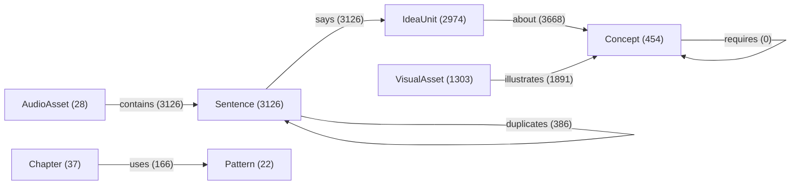

# Semantic graph overview

Generated 2026-10-08T19:59:59Z by `dc graph export`.

| Node type | Count |
|---|---|
| AudioAsset | 28 |
| Chapter | 37 |
| Concept | 454 |
| IdeaUnit | 2974 |
| Pattern | 22 |
| Sentence | 3126 |
| VisualAsset | 1303 |

| Edge type | Count |
|---|---|
| about | 3668 |
| contains | 3126 |
| duplicates | 386 |
| illustrates | 1891 |
| says | 3126 |
| uses | 166 |
