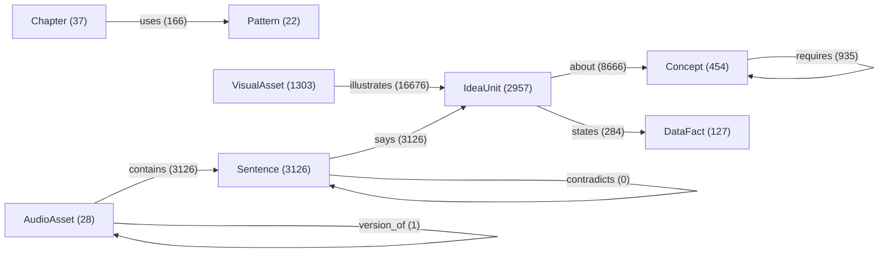

# Semantic graph overview

Generated 2026-10-08T20:20:01Z by `dc graph report`.

Idea-unit rule: tau 0.81, F1 0.876 on 200 labelled pairs (cosine only 0.803). Link floors (p95 of random cosine): concept 0.545, visual 0.567, fact 0.499. `illustrates` counts include 5 candidates per unit plus caption concept tags.

| Node type | Count |
|---|---|
| AudioAsset | 28 |
| Chapter | 37 |
| Concept | 454 |
| DataFact | 127 |
| IdeaUnit | 2957 |
| Pattern | 22 |
| Sentence | 3126 |
| VisualAsset | 1303 |

| Edge type | Count |
|---|---|
| about | 8666 |
| contains | 3126 |
| duplicates | 323 |
| illustrates | 16676 |
| requires | 935 |
| says | 3126 |
| states | 284 |
| uses | 166 |
| version_of | 1 |
